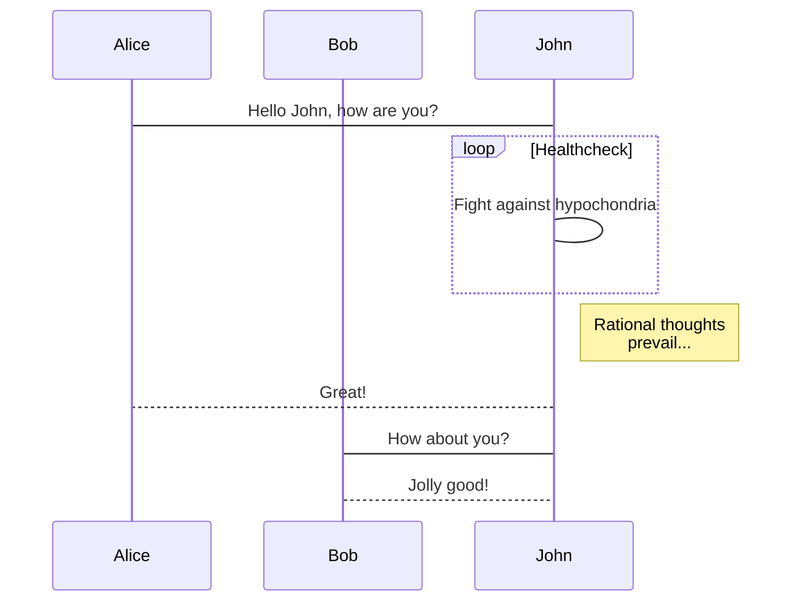
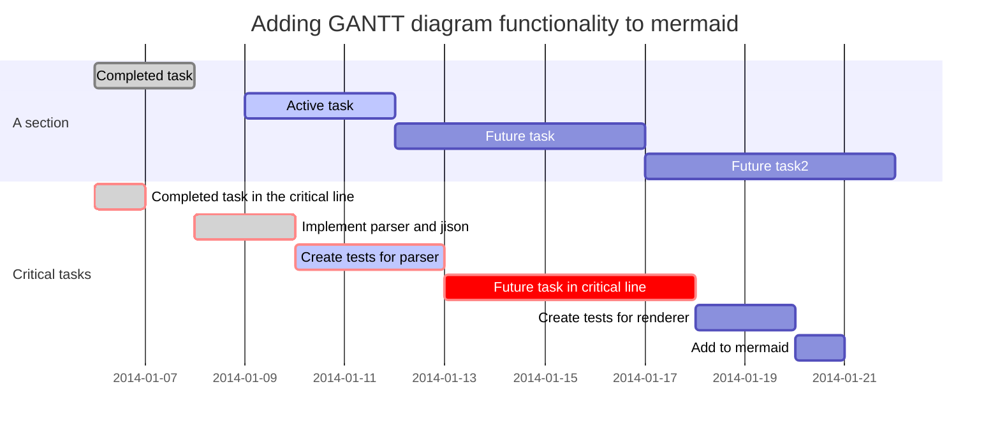

# mermaid

> Generation of diagrams and flowcharts from text in a similar manner as markdown.

Ever wanted to simplify documentation and avoid heavy tools like Visio when explaining your code?

This is why mermaid was born, a simple markdown-like script language for generating charts from text via javascript. [Try it using our editor][live-editor].

## Request for contribution

- Contribute to mermaid: https://github.com/knsv/mermaid
- Contribute to documentation: https://github.com/mermaidjs/mermaid-gitbook

### An example of a flowchart

### An example of a sequence diagram

### An example of a gantt diagram

Play with mermaid using this [live editor][live-editor].

## Credits

Many thanks to the [d3](https://d3js.org/) and [dagre-d3](https://github.com/cpettitt/dagre-d3) projects for providing the graphical layout and drawing libraries!
Thanks also to the [js-sequence-diagram](https://bramp.github.io/js-sequence-diagrams) project for usage of the grammar for the sequence diagrams.

*Mermaid was created by Knut Sveidqvist for easier documentation.*

Knut has not done all work by himself, here is the full list of the projects [contributors](https://github.com/knsv/mermaid/graphs/contributors).

# Downstream projects

Mermaid is supported in a number of publishing systems and editors. Please report if a plugin/editor is missing from the list below:

* [Markdown Plus](https://mdp.tylingsoft.com/) - Markdown editor with extra features
* [gitbook-plugin](https://github.com/JozoVilcek/gitbook-plugin-mermaid)
* [Confluence plugin](https://marketplace.atlassian.com/plugins/org.anvard.atlassian.mermaid-plugin/server/overview)
* [Using mermaid via docpad](http://nauvalatmaja.com/2015/01/13/rendering-mermaid-in-docpad/)
* [Using mermaid in Jekyll](https://rubygems.org/gems/jekyll-mermaid/versions/1.0.0)
* [Using mermaid via Octopress](http://mostlyblather.com/blog/2015/05/23/mermaid-jekyll-octopress/)
* [Using mermaid via Gatsby](https://github.com/konsumer/gatsby-remark-graph)
* [Mardown editor Haroopad](http://pad.haroopress.com/user.html)
* [Plugin for atom](https://atom.io/packages/atom-mermaid)
* [Atom Package markdown-preview-enhanced](https://atom.io/packages/markdown-preview-enhanced)
* [Vim Plugin](https://github.com/kannokanno/previm)
* [Sphinx extension](https://github.com/mgaitan/sphinxcontrib-mermaid)
* [Pandoc filter](https://github.com/raghur/mermaid-filter)
* [hads](https://github.com/sinedied/hads)
* [Mermaid Preview for VS Code](https://marketplace.visualstudio.com/items?itemName=vstirbu.vscode-mermaid-preview)
* [Package for Sublime Text 3](https://packagecontrol.io/packages/Mermaid)
* [MediaWiki extension](https://github.com/SemanticMediaWiki/Mermaid)
* [StackEdit](https://stackedit.io/app)
* [HackMd](https://hackmd.io)
* [remark.js](https://github.com/gnab/remark/wiki/Adding-graphs-via-Mermaid)
* [Leo Vue](https://github.com/kaleguy/leovue/wiki/Creating-Diagrams-with-Mermaid)
* [Typora](https://typora.io/) - Markdown editor for MacOS, Windows, and Linux

# Online live editor

An editor is available for creating diagrams. With it you can quickly start writing mermaid diagrams. It is possible to:

* save the result as a svg
* get a link to a viewer of the diagram
* get a link to edit of the diagram to share a diagram so that someone else can tweak it and send a new link back

* [Editor][live-editor]

[live-editor]: https://mermaidjs.github.io/mermaid-live-editor/
