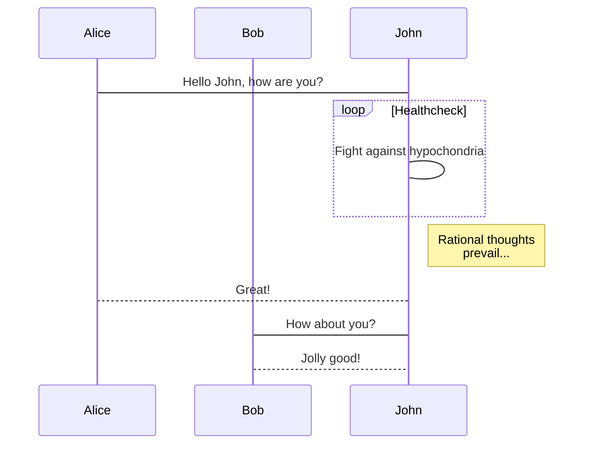
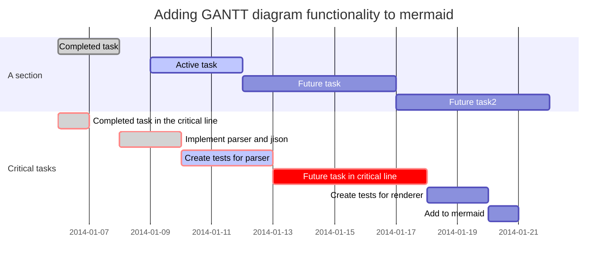

# mermaid 中文说明

> 使用 Markdown 风格用文本生成图表和流程图

有没有想过使用简单的方式去描述你的代码？避免使用类似 Visio 等这样臃肿的工具。

这就是为什么设计 mermaid 的初衷，它能够通过 javascript 让您使用类似 Markdown 风格的脚本语言生成图表。您可以试试我们的[在线编辑器][live-editor]。

## 感谢您来贡献

mermaid 正在开发中，还有很多不足以及需要增强的功能，我们欢迎您也加入我们：

- 给 mermaid 贡献代码: https://github.com/knsv/mermaid
- 贡献文档: https://github.com/mermaidjs/mermaid-gitbook

PS，这篇简体中文的文档翻译者是[明城](https://www.gracecode.com)，如果您有任何的意见和建议，可以直接邮件联系 `echo bWluZ2NoZW5nQG91dGxvb2suY29tCg== | base64 -d` ,非常感谢！

### 流程图的例子

### 序列图的例子

### 甘特图的例子

您可以使用[在线编辑器][live-editor]尝试下。

## 作者

非常感谢  [d3](https://d3js.org/) 以及 [dagre-d3](https://github.com/cpettitt/dagre-d3) 项目库提供了视图层以及绘画层的支持。同时也感谢  [js-sequence-diagram](https://bramp.github.io/js-sequence-diagrams) 项目提供了对序列图的语法支持。

*同时也感谢 Knut Sveidqvist  为 Mermaid 编写了更容易理解的文档。* Knut 并不是一个人在战斗，这里有个他的[项目列表](https://github.com/knsv/mermaid/graphs/contributors)，
欢迎您的加入！

# 下游项目

Mermaid 支持了数种发布系统以及编辑器，请参阅下方的列表以及提出如果列表中没有的项目：

* [Markdown Plus](https://mdp.tylingsoft.com/) - Markdown 编辑器以及支持多种扩展功能；
* [gitbook-plugin](https://github.com/JozoVilcek/gitbook-plugin-mermaid)
* [Confluence plugin](https://marketplace.atlassian.com/plugins/org.anvard.atlassian.mermaid-plugin/server/overview)
* [Using mermaid via docpad](http://nauvalatmaja.com/2015/01/13/rendering-mermaid-in-docpad/)
* [Using mermaid in Jekyll](https://rubygems.org/gems/jekyll-mermaid/versions/1.0.0)
* [Using mermaid via Octopress](http://mostlyblather.com/blog/2015/05/23/mermaid-jekyll-octopress/)
* [Using mermaid via Gatsby](https://github.com/konsumer/gatsby-remark-graph)
* [Mardown editor Haroopad](http://pad.haroopress.com/user.html)
* [Plugin for atom](https://atom.io/packages/atom-mermaid)
* [Atom Package markdown-preview-enhanced](https://atom.io/packages/markdown-preview-enhanced)
* [Vim Plugin](https://github.com/kannokanno/previm)
* [Sphinx extension](https://github.com/mgaitan/sphinxcontrib-mermaid)
* [Pandoc filter](https://github.com/raghur/mermaid-filter)
* [hads](https://github.com/sinedied/hads)
* [Mermaid Preview for VS Code](https://marketplace.visualstudio.com/items?itemName=vstirbu.vscode-mermaid-preview)
* [Package for Sublime Text 3](https://packagecontrol.io/packages/Mermaid)
* [MediaWiki extension](https://github.com/SemanticMediaWiki/Mermaid)
* [StackEdit](https://stackedit.io/app)
* [HackMd](https://hackmd.io)
* [remark.js](https://github.com/gnab/remark/wiki/Adding-graphs-via-Mermaid)
* [Leo Vue](https://github.com/kaleguy/leovue/wiki/Creating-Diagrams-with-Mermaid)
* [Typora](https://typora.io/) - 跨平台的 Markdown 编辑器。

# 在线编辑器

这里有个在线编辑器可以供您制作图表，同时您也可以快速了解 Mermaid 的些特性。它提供了：

* 保存图表为 svg 格式；
* 通过链接查看指定的图表；
* 通过链接可以编辑、分享图表，同时其他人也可以调整以及生成新的连接。

* [Editor][live-editor]

[live-editor]: https://mermaidjs.github.io/mermaid-live-editor/
