# Flowcharts - Basic Syntax 流程图 - 基本的语法

## Graph 图形

This statement declares a new graph and the direction of the graph layout.

This declares a graph oriented from top to bottom.

这块定义了新的图形以及图形的布局和顺序。例如，下面定义了流程图从上到下。

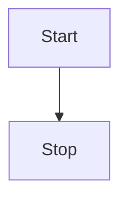

This declares a graph oriented from left to right.

这里定义了图形从左到右，

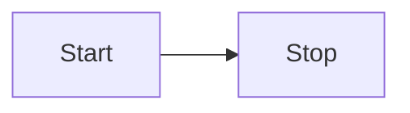

还有其他的定义如下：

Possible directions are:

* TB - top bottom 从上到下
* BT - bottom top 从下到上
* RL - right left 从右到左
* LR - left right 从左到右
* TD - same as TB 和 TB 一样的定义

## Nodes & shapes

节点和形状

### A node (default) 一个节点（默认）

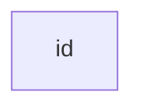
Note that the id is what is displayed in the box.

注意 id 会被当做文案，然后在图中显示为个节点。

### A node with text 节点中的文案

It is also possible to set text in the box that differs from the id. If this is done several times, it is the last text
found for the node that will be used. Also if you define edges for the node later on, you can omit text definitions. The
one previously defined will be used when rendering the box.

当然我们可以根据不同的 id 自定义你想要的文案。如果您多次定义了文案，则只会选取最后个定义的文案。此外，如果后面定义了边框，则您可以忽略文本的定义。


### A node with round edges 定义个圆角边框的节点

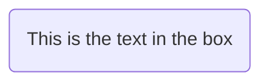

### A node in the form of a circle 定义个圆形的节点

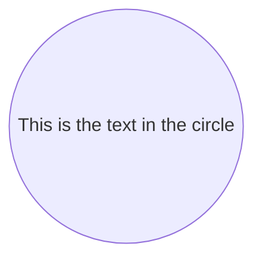

### A node in an asymetric shape 定义个不对称图案的节点（类似于星旗）


Currently only the shape above is possible and not its mirror. *This might change with future releases.*

现在您有了不对称图案的节点，*（这可能在后续版本中更改图案）*。

### A node (rhombus) 菱形的节点（通常用于判断）

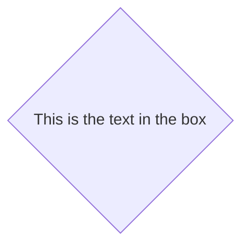

## Links between nodes 链接节点

Nodes can be connected with links/edges. It is possible to have different types of links or attach a text string to a link.

节点之间可以相互链接，同时链接还可以加入文案来说明链接的不同类型。

### A link with arrow head 使用箭头链接


### An open link 开放式链接

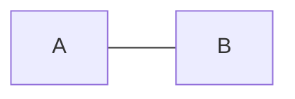

### Text on links 链接上标注文案

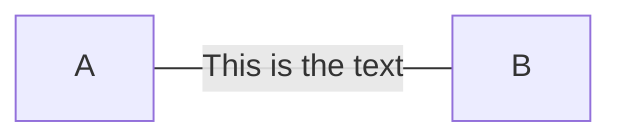

or 或者


### A link with arrow head and text 箭头链接带上文案

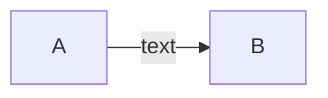

or 或者


### Dotted link 点状的链接

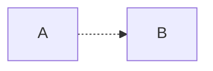

### Dotted link with text 点状的连接加上文案

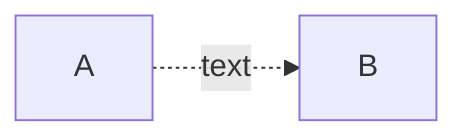

### Thick link 加粗链接

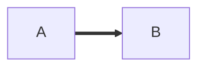

### Thick link with text 加粗链接并带上文案

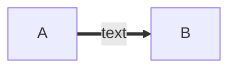

## Special characters that break syntax 特殊字符有可能破坏语法

It is possible to put text within quotes in order to render more troublesome characters. As in the example below:

可能在文案中带有特殊字符，这可能会让解析器难以理解，所以我们需要使用引号转义。下面是个例子：


### Entity codes to escape characters 使用实体字符（）用来转义

It is possible to escape characters using the syntax examplified here.

我们可以使用实体字符来转义，例如下面的例子：


## Subgraphs 子图

```
subgraph title
    graph definition
end
```

An example below:

下面是个例子：

```mermaid
graph TB
    c1-->a2
    subgraph one
    a1-->a2
    end
    subgraph two
    b1-->b2
    end
    subgraph three
    c1-->c2
    end
 ```


## Interaction 互动

It is possible to bind a click event to a node, the click can lead to either a javascript callback or to a link which will be opened in a new browser tab.

可以使用 click 定义个节点的点击行为，例如可以点击个节点执行 Javascript 的回调或者点击个连接打开浏览器的页面。

```
click nodeId callback
```

* nodeId is the id of the node 、 nodeId 是个节点的 id
* callback is the name of a javascript function defined on the page displaying the graph, the function will be called with the nodeId as parameter.

callback 是个 JavaScript 的函数名称，同时这个函数回调的第一参数会被带入节点的 nodeId。

Examples of tooltip usage below:

下面是个例子，用来弹出个 alert：

```
<script>
    var callback = function(){
        alert('A callback was triggered');
    }
<script>
```

```
graph LR;
    A-->B;
    click A callback "Tooltip for a callback"
    click B "http://www.github.com" "This is a tooltip for a link"
```

The tooltip text is surrounded in double quotes. The styles of the tooltip are set by the class .mermaidTooltip.

提示 tooltip 使用双引号包裹起来，同时 tooltip 本身的样式可以使用 .mermaidTooltip 样式类来定义。

```mermaid
graph LR;
    A-->B;
    click A callback "Tooltip"
    click B "http://www.github.com" "This is a link"
```
> **Success** The tooltip functionality and the ability to link to urls are available from version 0.5.2.

toolstip 的回调以及直接支持链接在 0.5.2 版本以后开始支持。


## Styling and classes 样式和类

### Styling links 链接样式

It is possible to style links. For instance you might want to style a link that is going backwards in the flow. As links
have no ids in the same way as nodes, some other way of deciding what style the links should be attached to is required.
Instead of ids, the order number of when the link was defined in the graph is used. In the example below the style
defined in the linkStyle statement will belong to the fourth link in the graph:

链接也可以自定义不分的样式，例如你想自定义回源链接的样式，以便于区分。但是链接没有 id 用来区分，所以只能使用另外个办法来定义样式。我们可以使用图形的顺序来替代使用 id 来定义样式。例如下面的例子，我们使用 linkStyle 语法来定义在图形中的第四条链接的样式。

```
linkStyle 3 stroke:#ff3,stroke-width:4px;
```


### Styling a node 自定义节点样式

It is possible to apply specific styles such as a thicker border or a different background color to a node.

当然，我们也可以定义节点的样式，例如自定义边框的样色以及线条的样式。

```mermaid
graph LR
    id1(Start)-->id2(Stop)
    style id1 fill:#f9f,stroke:#333,stroke-width:4px
    style id2 fill:#ccf,stroke:#f66,stroke-width:2px,stroke-dasharray: 5, 5
```


#### Classes 样式类

More convenient then defining the style every time is to define a class of styles and attach this class to the nodes that
should have a different look.

当然，我们可以定义个样式类来管理重复的样式，这样子节点可以方便使用不同的外观。

a class definition looks like the example below:

定义个样式类的语法类似下面的语法：

```
    classDef className fill:#f9f,stroke:#333,stroke-width:4px;
```

Attachment of a class to a node is done as per below:

节点和样式类绑定可以看起来下面的样子：

```
    class nodeId1 className;
```

It is also possible to attach a class to a list of nodes in one statement:

当然，可以使用一条语句同时定义多个节点来绑定同个样式类：

```
    class nodeId1,nodeId2 className;
```


### Css classes CSS 类

It is also possible to predefine classes in css styles that can be applied from the graph definition as in the example
below:

还可以还在页面中直接定义 CSS 类，然后绑定样式到图形中。类似下面的例子：

**样式的例子**

```html
<style>
    .cssClass > rect{
        fill:#FF0000;
        stroke:#FFFF00;
        stroke-width:4px;
    }
</style>
```

**定义的例子**

```
graph LR;
    A-->B[AAA<span>BBB</span>];
    B-->D;
    class A cssClass;
```


### Default class 默认样式类

If a class is named default it will be assigned to all classes without specific class definitions.

有个默认样式的名称为 default ，我们可以直接修改来更改默认的图形样式。

```
    classDef default fill:#f9f,stroke:#333,stroke-width:4px;
```


## Basic support for fontawesome 的些基本支持

It is possible to add icons from fontawesome.

还可以使用 fontawesome 来直接使用增加小图标的支持,

The icons are acessed via the syntax fa:#icon class name#.

定义使用图标样式可以使用语法 fa:#icon class name 。

```mermaid
graph TD
    B["fa:fa-twitter for peace"]
    B-->C[fa:fa-ban forbidden]
    B-->D(fa:fa-spinner);
    B-->E(A fa:fa-camera-retro perhaps?);
```


## Graph declarations with spaces between vertices and link and without semicolon

图形定义顶点以及链接不需要使用分号


* In graph declarations, the statements also can now end without a semicolon. After release 0.2.16, ending a graph statement with semicolon is just optional. So the below graph declaration is also valid along with the old declarations of the graph.

在图形定义中，每个语句不需要使用分号结尾。
在 0.2.16 以后的版本，结尾的分号是可选的。所以，下面的图形定于语法可以兼容老的语法。

* A single space is allowed between vertices and the link. However there should not be any space between a vertex and its text and a link and its text. The old syntax of graph declaration will also work and hence this new feature is optional and is introduce to improve readability.

顶点和链接中支持使用单个空格。为了可读性考虑，您可以使用任意个空格来分割顶点以及链接。在老的语法中这个定义依然有效，但新的语法会过滤多余的空格。

Below is the new declaration of the graph edges which is also valid along with the old declaration of the graph edges.

下面新的图形定义语法，依然可以兼容老版本的图形定义。

```mermaid
graph LR
    A[Hard edge] -->|Link text| B(Round edge)
    B --> C{Decision}
    C -->|One| D[Result one]
    C -->|Two| E[Result two]
```


## Configuration... 配置

Is it possible to adjust the width of the rendered flowchart.

可以使用些简单的配置来调整流程图的宽度。

This is done by defining **mermaid.flowchartConfig** or by the CLI to use a json file with the configuration. How to use
the CLI is described in the mermaidCLI page.
mermaid.flowchartConfig can be set to a JSON string with config parameters or the corresponding object.

我们可以定义使用 **mermaid.flowchartConfig** 配置项或者在命令行模式中使用对应的 json 配置文件来管理。如何使用命令行请参见 mermaidCLI 页面。 **mermaid.flowchartConfig** 配置项可以使用 JSON 字符串哥是或者类型的对象类型。

```javascript
mermaid.flowchartConfig = {
    width: 100%
}
```
