# 流程图 - 基本的语法

## 图形

这块定义了新的图形以及图形的布局和顺序。例如，下面定义了流程图从上到下排列：

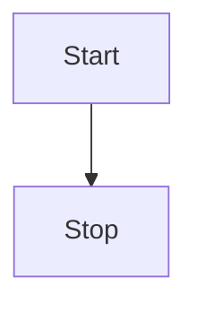

这里定义了图形从左到右，

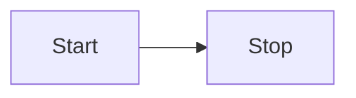

还有其他的定义如下：

* TB - 从上到下
* BT - 从下到上
* RL - 从右到左
* LR - 从左到右
* TD - 和 TB 一样的定义

## 节点和形状

### 一个节点（默认）

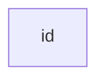

注意 id 的名字会被当做节点文案，然后在图中显示。

### 节点中的文案

当然，可以根据不同的 id 自定义你想要的文案。如果同个节点多次定义了文案，则只会选取最后个定义的文案。

此外，如果重复后面定义了边框样式，会被忽略。

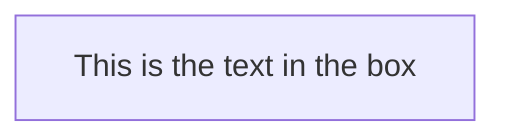

### 定义个圆角边框的节点

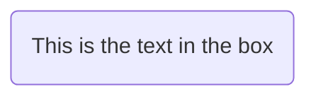

### 定义个圆形的节点

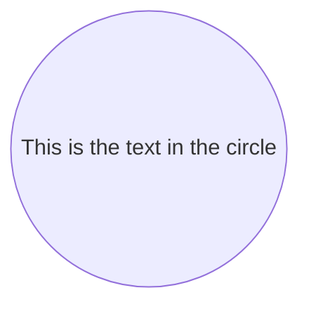

### 定义个不对称图案的节点（类似于星旗）

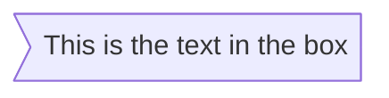

现在您有了不对称图案的节点，**（这可能在后续版本中更改图案）**。

### 菱形的节点（通常用于判断）

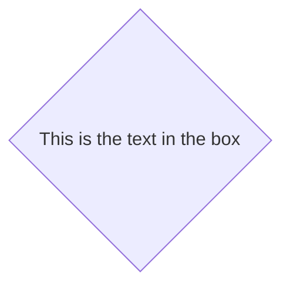

## 链接节点

节点之间可以相互链接，同时链接还可以加入文案来说明链接的不同类型和样式。

### 使用箭头链接


### 开放式链接

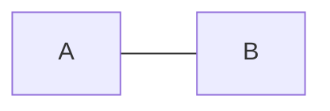

### 链接上标注文案

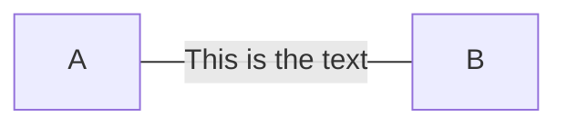

或者


### 箭头链接带上文案

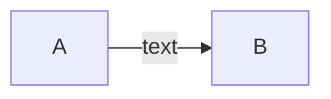

或者


### 点状的链接

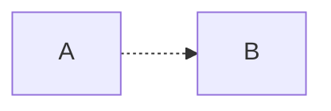

### 点状的连接加上文案

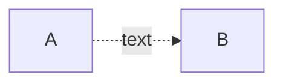

### 加粗链接

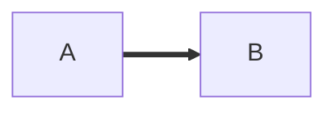

### 加粗链接并带上文案

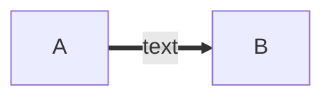

## 特殊字符有可能会和语法冲突

可能在文案中带有特殊字符，这可能会让解析器难以理解，所以我们需要使用引号转义。下面是个例子：

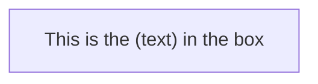

### 使用实体字符（Entity codes）用来转义

还可以使用实体字符来转义，例如下面的例子：

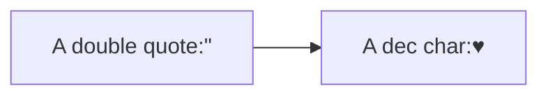

## 子图

```
subgraph title
    graph definition
end
```

下面是个例子：

```mermaid
graph TB
    c1-->a2
    subgraph one
    a1-->a2
    end
    subgraph two
    b1-->b2
    end
    subgraph three
    c1-->c2
    end
 ```


## 互动

可以使用点击事件（click）定义节点的交互行为。例如，可以点击个节点执行 某个 Javascript 的回调或者打开浏览器的页面。

```
click nodeId callback
```

* nodeId 是个节点的 id
* callback 是个 JavaScript 的函数名称，同时这个函数回调的第一参数会被带入节点的 nodeId。

下面是个例子，用来弹出个 alert：

```
<script>
    var callback = function(){
        alert('A callback was triggered');
    }
<script>
```

```
graph LR;
    A-->B;
    click A callback "Tooltip for a callback"
    click B "http://www.github.com" "This is a tooltip for a link"
```

提示 tooltip 使用双引号包裹起来，同时 tooltip 本身的样式可以使用 `.mermaidTooltip` 样式类来定义。

```mermaid
graph LR;
    A-->B;
    click A callback "Tooltip"
    click B "http://www.github.com" "This is a link"
```
> **Success** toolstip 的回调以及直接支持链接在 0.5.2 版本以后开始支持。


## 样式和类

### 链接样式

链接也可以自定义不分的样式，例如你想自定义回源链接的样式，以便于区分。但是，链接没有 id 用来区分，所以只能使用另外个办法来定义样式。

我们可以使用链接的顺序来替代使用 id 来定义样式。例如下面的例子，我们使用  `linkStyle` 来定义在图形中的第四条链接（从零开始算）的样式。

```
linkStyle 3 stroke:#ff3,stroke-width:4px;
```

### 自定义节点样式

也可以定义节点的样式，自定义边框的样色以及线条的样式。

```mermaid
graph LR
    id1(Start)-->id2(Stop)
    style id1 fill:#f9f,stroke:#333,stroke-width:4px
    style id2 fill:#ccf,stroke:#f66,stroke-width:2px,stroke-dasharray: 5, 5
```


#### 样式类

当然，我们可以定义个样式类来管理重复的样式，这样子节点可以方便使用不同的外观。

定义个样式类的语法类似下面的语法：

```
    classDef className fill:#f9f,stroke:#333,stroke-width:4px;
```

节点和样式类绑定可以看起来下面的样子：

```
    class nodeId1 className;
```

当然，可以使用一条语句同时定义多个节点来绑定同个样式类：

```
    class nodeId1,nodeId2 className;
```


### CSS 类

还可以还在页面中直接定义 CSS 类，然后应用样式到图形中。类似下面的例子：

**样式的例子**

```html
<style>
    .cssClass > rect{
        fill:#FF0000;
        stroke:#FFFF00;
        stroke-width:4px;
    }
</style>
```

**定义的例子**

```
graph LR;
    A-->B[AAA<span>BBB</span>];
    B-->D;
    class A cssClass;
```


### 默认样式类

有个默认样式的名称为 `default`，我们可以直接修改来更改默认的图形样式。

```
    classDef default fill:#f9f,stroke:#333,stroke-width:4px;
```


## fontawesome 的些基本支持

还可以使用 fontawesome 来直接使用增加小图标的支持，定义使用图标样式可以使用语法 `fa:#icon class name`。

```mermaid
graph TD
    B["fa:fa-twitter for peace"]
    B-->C[fa:fa-ban forbidden]
    B-->D(fa:fa-spinner);
    B-->E(A fa:fa-camera-retro perhaps?);
```


## 图形定义元素已经不需要使用分号

* 在图形定义中，每个语句不需要使用分号结尾。在 0.2.16 以后的版本，结尾的分号是可选的。所以，下面的图形定于语法可以兼容老的语法。
* 顶点和链接中支持使用单个空格。为了可读性考虑，您可以使用任意个空格来分割顶点以及链接。在老的语法中这个定义依然有效，但新的语法会过滤多余的空格。

下面新的图形定义语法，依然可以兼容老版本的图形定义。

```mermaid
graph LR
    A[Hard edge] -->|Link text| B(Round edge)
    B --> C{Decision}
    C -->|One| D[Result one]
    C -->|Two| E[Result two]
```


## 配置

可以使用些简单的配置来调整流程图的宽度。我们可以定义使用 **mermaid.flowchartConfig** 配置项或者在命令行模式中使用对应的 json 配置文件来管理。如何使用命令行请参见 mermaidCLI 页面。 **mermaid.flowchartConfig** 配置项可以使用 JSON 字符串哥是或者类型的对象类型。

```javascript
mermaid.flowchartConfig = {
    width: 100%
}
```
