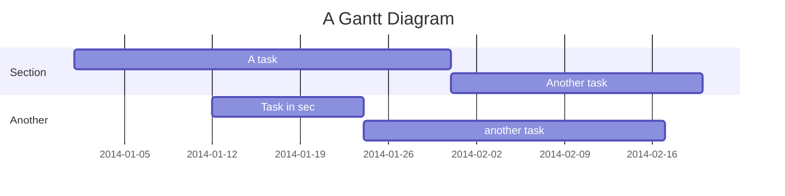

# 甘特图

**Notice** 译者注：原作者没有写完这块，考虑是否扩写。

> 甘特图是一种柱状图，用来描述项目的安排和进展。最先是在 1910s 年代  Henry Gantt 提出了这个构想和概念，然后在 1986 年 Karol Adamiecki 开发了最早的版本。甘特图描述了段项目时间内的对应的具体事项的进度和安排。

Mermaid 可以制作甘特图，下面是个完整的实例：




## 语法

```mermaid
gantt
       dateFormat  YYYY-MM-DD
       title Adding GANTT diagram functionality to mermaid

       section A section
       Completed task            :done,    des1, 2014-01-06,2014-01-08
       Active task               :active,  des2, 2014-01-09, 3d
       Future task               :         des3, after des2, 5d
       Future task2              :         des4, after des3, 5d

       section Critical tasks
       Completed task in the critical line :crit, done, 2014-01-06,24h
       Implement parser and jison          :crit, done, after des1, 2d
       Create tests for parser             :crit, active, 3d
       Future task in critical line        :crit, 5d
       Create tests for renderer           :2d
       Add to mermaid                      :1d

       section Documentation
       Describe gantt syntax               :active, a1, after des1, 3d
       Add gantt diagram to demo page      :after a1  , 20h
       Add another diagram to demo page    :doc1, after a1  , 48h

       section Last section
       Describe gantt syntax               :after doc1, 3d
       Add gantt diagram to demo page      :20h
       Add another diagram to demo page    :48h
   ```

### 标题

Tbd


## 节点语句

Tbd


## 配置日期

Tbd


### 日期格式

Tbd


### 定义图表

输入	描述:

```
YYYY	2014	4 digit year
YY	14	2 digit year
Q	1..4	Quarter of year. Sets month to first month in quarter.
M MM	1..12	Month number
MMM MMMM	January..Dec	Month name in locale set by moment.locale()
D DD	1..31	Day of month
Do	1st..31st	Day of month with ordinal
DDD DDDD	1..365	Day of year
X	1410715640.579	Unix timestamp
x	1410715640579	Unix ms timestamp

Input	Example	Description
H HH	0..23	24 hour time
h hh	1..12	12 hour time used with a A.
a A	am pm	Post or ante meridiem
m mm	0..59	Minutes
s ss	0..59	Seconds
S	0..9	Tenths of a second
SS	0..99	Hundreds of a second
SSS	0..999	Thousandths of a second
Z ZZ	+12:00	Offset from UTC as +-HH:mm, +-HHmm, or Z
```

更多信息请参见： http://momentjs.com/docs/#/parsing/string-format/


### 比例

```
%a - abbreviated weekday name.
%A - full weekday name.
%b - abbreviated month name.
%B - full month name.
%c - date and time, as "%a %b %e %H:%M:%S %Y".
%d - zero-padded day of the month as a decimal number [01,31].
%e - space-padded day of the month as a decimal number [ 1,31]; equivalent to %_d.
%H - hour (24-hour clock) as a decimal number [00,23].
%I - hour (12-hour clock) as a decimal number [01,12].
%j - day of the year as a decimal number [001,366].
%m - month as a decimal number [01,12].
%M - minute as a decimal number [00,59].
%L - milliseconds as a decimal number [000, 999].
%p - either AM or PM.
%S - second as a decimal number [00,61].
%U - week number of the year (Sunday as the first day of the week) as a decimal number [00,53].
%w - weekday as a decimal number [0(Sunday),6].
%W - week number of the year (Monday as the first day of the week) as a decimal number [00,53].
%x - date, as "%m/%d/%Y".
%X - time, as "%H:%M:%S".
%y - year without century as a decimal number [00,99].
%Y - year with century as a decimal number.
%Z - time zone offset, such as "-0700".
%% - a literal "%" character.
```

更多信息请参见： https://github.com/mbostock/d3/wiki/Time-Formatting


## 样式

可以定义甘特图的多种 CSS 样式，下面是一份具体的列表：

### Classes used 已定义的样式类

类名称 | 描述
---          | ---
actor        | Style for the actor box at the top of the diagram.
text.actor   | Styles for text in the actor box at the top of the diagram.
actor-line   | The vertical line for an actor.
messageLine0 | Styles for the solid message line.
messageLine1 | Styles for the dotted message line.
messageText  | Defines styles for the text on the message arrows.
labelBox     | Defines styles label to left in a loop.
labelText    | Styles for the text in label for loops.
loopText     | Styles for the text in the loop box.
loopLine     | Defines styles for the lines in the loop box.
note         | Styles for the note box.
noteText     | Styles for the text on in the note boxes.


### 样式例子

```css
.grid .tick {
    stroke: lightgrey;
    opacity: 0.3;
    shape-rendering: crispEdges;
}
.grid path {
    stroke-width: 0;
}

#tag {
    color: white;
    background: #FA283D;
    width: 150px;
    position: absolute;
    display: none;
    padding:3px 6px;
    margin-left: -80px;
    font-size: 11px;
}

#tag:before {
    border: solid transparent;
    content: ' ';
    height: 0;
    left: 50%;
    margin-left: -5px;
    position: absolute;
    width: 0;
    border-width: 10px;
    border-bottom-color: #FA283D;
    top: -20px;
}
.taskText {
    fill:white;
    text-anchor:middle;
}
.taskTextOutsideRight {
    fill:black;
    text-anchor:start;
}
.taskTextOutsideLeft {
    fill:black;
    text-anchor:end;
}
```

## 配置

可以调整甘特图边距等配置的渲染信息。具体的配置可以使用配置对象的 `ganttConfig` 节点，有关如何使用命令行配置参考  [mermaidCLI](zh-cn/mermaidCLI.md) 页面。`mermaid.ganttConfig` 可以传入 JSON 字符串配置参数或者对应的对象类型。

```javascript
mermaid.ganttConfig = {
    titleTopMargin:25,
    barHeight:20,
    barGap:4,
    topPadding:75,
    sidePadding:75
}
```

### 配置的参数

参数 | 定义 |  默认值
--- | --- | ---
mirrorActor| 关闭或者打开操作者（Actors）在图中是否被覆盖|false
bottomMarginAdj|调整图的下部边距，因为可能设置的样式边框过粗会超出边距，因此在实际情况中需要做适当的调整。|1
