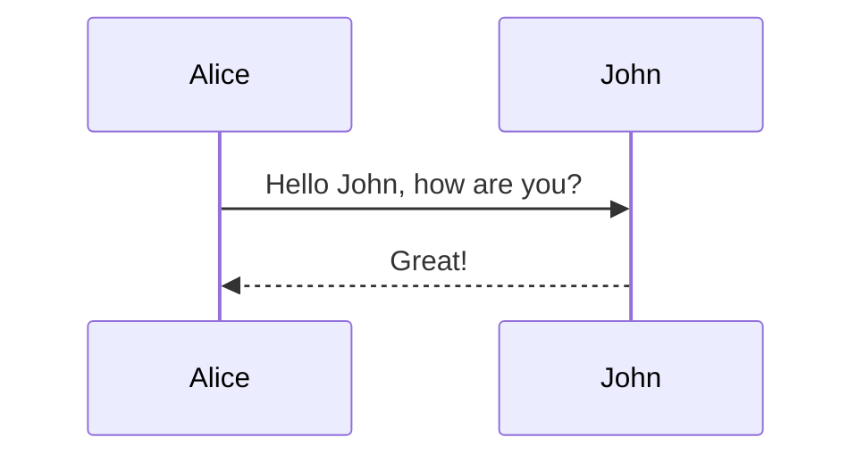
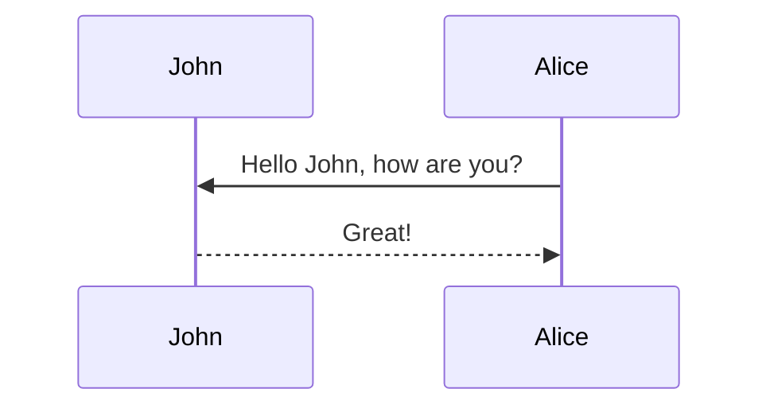
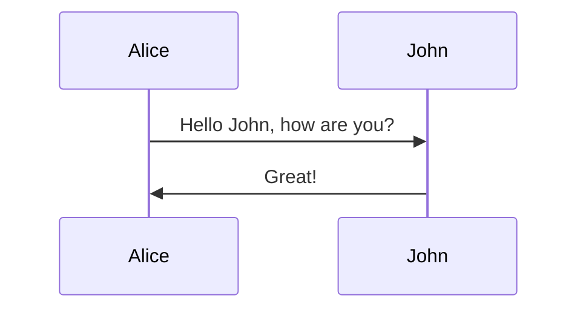
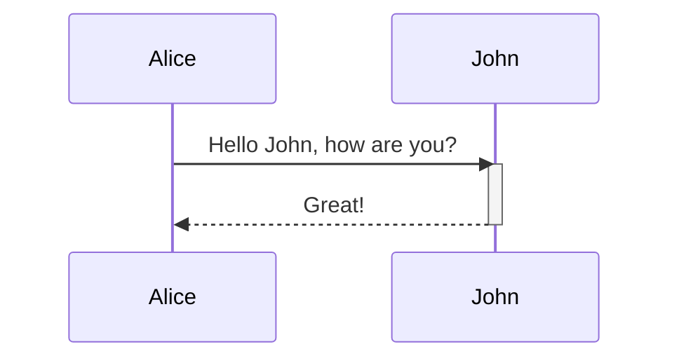
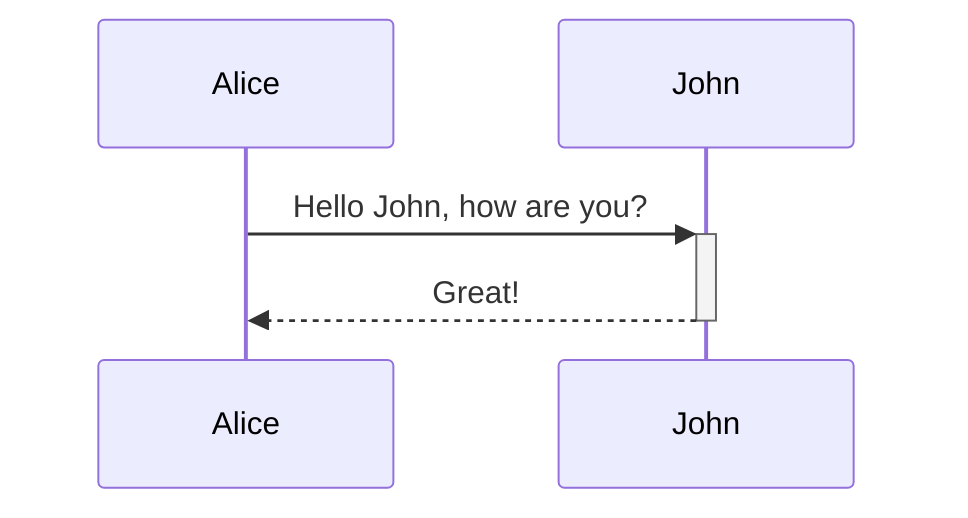
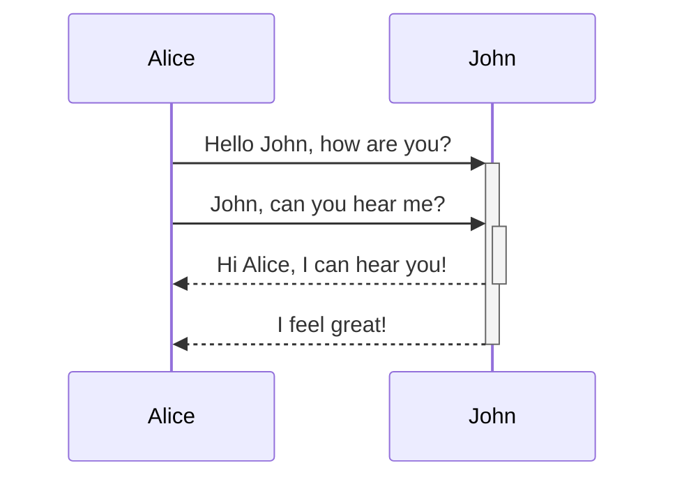
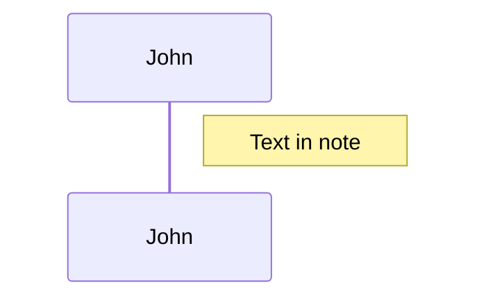
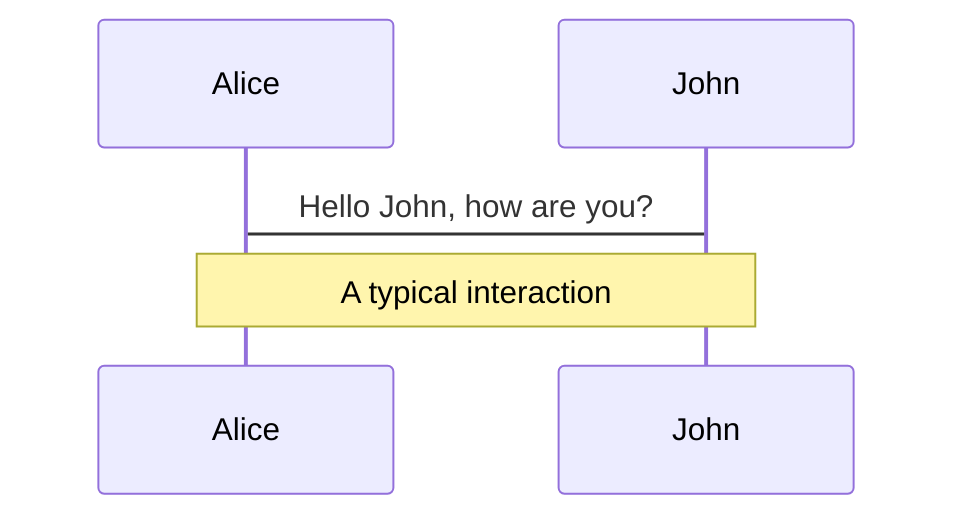
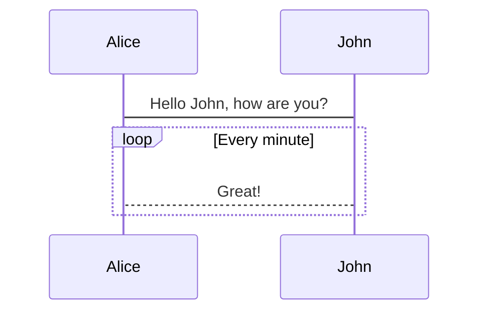
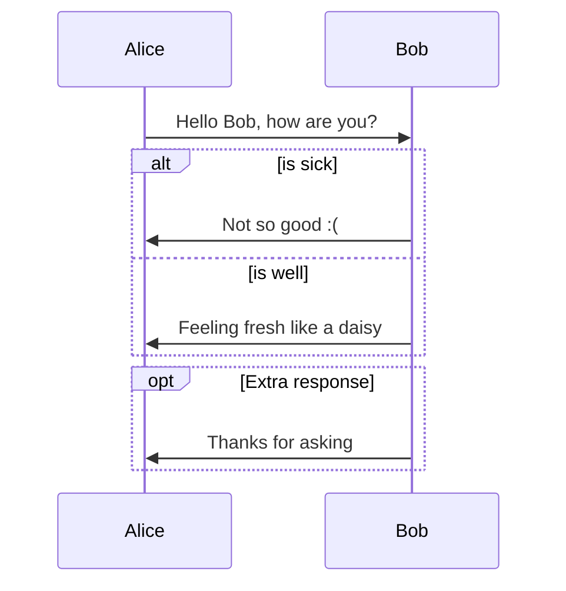

# Sequence diagrams 序列图

> A Sequence diagram is an interaction diagram that shows how processes operate with one another and in what order.

> 序列图是用来描述对象之间消息顺序的图（详细可以参见 https://en.wikipedia.org/wiki/Sequence_diagram ）

Mermaid can render sequence diagrams.

Mermaid 可以用来生成序列图



## Syntax 语法

### Participants 参与者

The participants can be defined implicitly as in the first example on this page. The participants or actors are
rendered in order of appearance in the diagram source text. Sometimes you might want to show the participants in a
different order than how they appear in the first message. It is possible to specify the actor's order of
appearance by doing the following:

参与者的定义可以类似第一个例子中隐式的声明定义。参与者或者执行者可以在源代码定义中按照顺序渲染出来。有时候你想显示参与者为不同的顺序，而不是像第一个例子一样顺序输出。那么你可以如下显示声明参与者的顺序：



### Aliases 别名

The actor can have a convenient identifier and a descriptive label.

每个执行者可以使用 id 然后带上对应的别名，方便记忆和整理。



## Messages 信息

Messages can be of two displayed either solid or with a dotted line.

信息可以使用虚线以及实线两者来标注。

```
[Actor][Arrow][Actor]:Message text
```

There are six types of arrows currently supported:

目前，有六个类型的箭头样式可以使用：

Type 类型 | Description 面熟
---  | ---
->   | Solid line without arrow 没有箭头实线
-->  | Dotted line  without arrow 没有箭头的虚线
->>  | Solid line with arrowhead 带箭头的实线
-->> | Dotted line  with arrowhead 带箭头的虚线
-x   | Solid line with a cross at the end (async) 带交叉箭头的实线（异步）
--x  | Dotted line with a cross at the end (async) 带交叉箭头的虚线（异步）


## Activations 激活

It is possible to activate and deactivate an actor. (de)activation can be dedicated declarations:

同时，支持描述是否激活（activate）制定的参与者。描述是否激活可以这样子定义：

> *Warning* 译者注：这里的表述可能会有些混淆，[根据 MSDN 的描述是「执行匹配项」](https://msdn.microsoft.com/zh-cn/library/dd409377.aspx)。所以这里具体会意即可，根据事情情况使用。




也可以使用 `+`/`-` 用于简化的描述，如下：
There is also a shortcut notation by appending `+`/`-` suffix to the message arrow:



Activations can be stacked for same actor:

同个参与者可以堆叠「激活」，参见：




## Notes 标注

It is possible to add notes to a sequence diagram. This is done by the notation
Note [ right of | left of | over ] [Actor]: Text in note content

序列图中支持标注定义，它基本的语法是 `Note [ right of | left of | over ] [Actor]: Text in note content` 。

See the example below:
类似以下的样子：



It is also possible to create notes spanning two participants:

也可以同时在两个参与者同时显示标注，例如：




## Loops 循环

It is possible to express loops in a sequence diagram. This is done by the notation

同时也支持如何在图表中描述循环，它使用标注定义：

```
loop Loop text
... statements ...
end
```

参见下面的例子：
See the example below:




## Alt 分支

It is possible to express alternative paths in a sequence diagram. This is done by the notation

支持在图表中描述选择，它使用标注定义：

```
alt Describing text
... statements ...
else
... statements ...
end
```

or if there is sequence that is optional (if without else).

或者描述以下是可选的（没有 else 语句）：

```
opt Describing text
... statements ...
end
```

下面是具体的例子：
See the example below:




## Styling 样式化

Styling of the a sequence diagram is done by defining a number of css classes.  During rendering these classes are extracted from the

序列图支持多种节点样式的自定义，下面是具体的样式类。

### Classes used 已经使用的样式类

Class  样式类      | Description 描述
---          | ---
actor        | Style for the actor box at the top of the diagram. 序列图中执行者的边框样式
text.actor   | Styles for text in the actor box at the top of the diagram. 序列图中执行者的文本样式
actor-line   | The vertical line for an actor. 执行者中的直线样式
messageLine0 | Styles for the solid message line. 实线信息线的样式
messageLine1 | Styles for the dotted message line. 虚线信息线的样式
messageText  | Defines styles for the text on the message arrows. 信息链接文案的样式
labelBox     | Defines styles label to left in a loop. 循环框的样式
labelText    | Styles for the text in label for loops. 循环框的文本样式
loopText     | Styles for the text in the loop box. 循环框的内部文本样式
loopLine     | Defines styles for the lines in the loop box. 定义循环框的行样式
note         | Styles for the note box. 标注框的样式
noteText     | Styles for the text on in the note boxes. 标注框的文本样式


### Sample stylesheet 样式例子


```css
body {
    background: white;
}

.actor {
    stroke: #CCCCFF;
    fill: #ECECFF;
}
text.actor {
    fill:black;
    stroke:none;
    font-family: Helvetica;
}

.actor-line {
    stroke:grey;
}

.messageLine0 {
    stroke-width:1.5;
    stroke-dasharray: "2 2";
    marker-end:"url(#arrowhead)";
    stroke:black;
}

.messageLine1 {
    stroke-width:1.5;
    stroke-dasharray: "2 2";
    stroke:black;
}

#arrowhead {
    fill:black;

}

.messageText {
    fill:black;
    stroke:none;
    font-family: 'trebuchet ms', verdana, arial;
    font-size:14px;
}

.labelBox {
    stroke: #CCCCFF;
    fill: #ECECFF;
}

.labelText {
    fill:black;
    stroke:none;
    font-family: 'trebuchet ms', verdana, arial;
}

.loopText {
    fill:black;
    stroke:none;
    font-family: 'trebuchet ms', verdana, arial;
}

.loopLine {
    stroke-width:2;
    stroke-dasharray: "2 2";
    marker-end:"url(#arrowhead)";
    stroke: #CCCCFF;
}

.note {
    stroke: #decc93;
    stroke: #CCCCFF;
    fill: #fff5ad;
}

.noteText {
    fill:black;
    stroke:none;
    font-family: 'trebuchet ms', verdana, arial;
    font-size:14px;
}
```


## Configuration 配置

Is it possible to adjust the margins for rendering the sequence diagram.

我们可以调整序列图的间距等配置。

This is done by defining `mermaid.sequenceConfig` or by the CLI to use a json file with the configuration.
How to use the CLI is described in the [mermaidCLI](mermaidCLI.html) page.
`mermaid.sequenceConfig` can be set to a JSON string with config parameters or the corresponding object.

使用 `mermaid.sequenceConfig`  或者在命令行下使用 json 格式文件进行配置。如何使用命令行下的配置可以参见 [mermaidCLI](zh-cn/mermaidCLI.html) 页面，`mermaid.sequenceConfig` 可以使用 JSON 字符串或者对应的对象。

```javascript
mermaid.sequenceConfig = {
    diagramMarginX:50,
    diagramMarginY:10,
    boxTextMargin:5,
    noteMargin:10,
    messageMargin:35,
    mirrorActors:true
};
```

### Possible configration params: 可以使用的配置参数

Param 参数 | Descriotion 描述 | Default value 默认值
--- | --- | ---
mirrorActor | Turns on/off the rendering of actors below the diagram as well as above it
 关闭或者打开参与者是否在覆盖在图中（不占用位置）
 | false
bottomMarginAdj |
调整图的下部边距，因为可能设置的样式边框过粗会超出边距，因此在实际情况中需要做适当的调整。
Adjusts how far down the graph ended. Wide borders styles with css could generate unwantewd clipping which is why this config param exists. | 1
