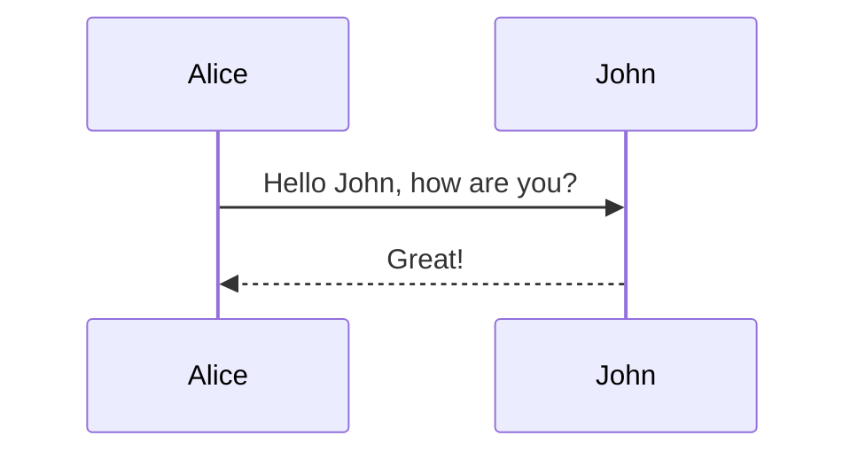
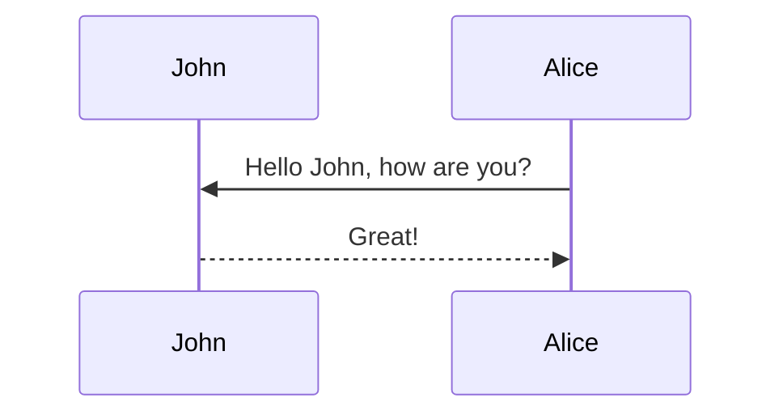
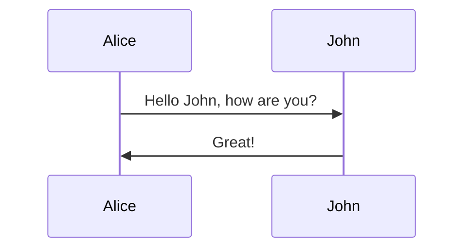
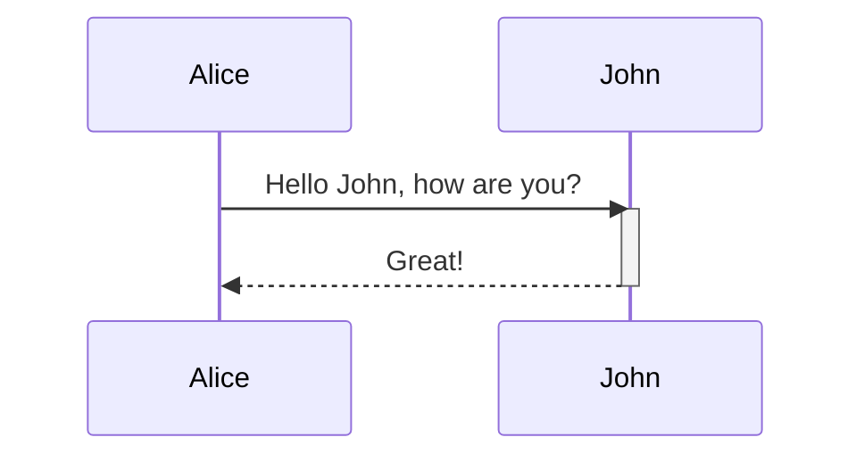
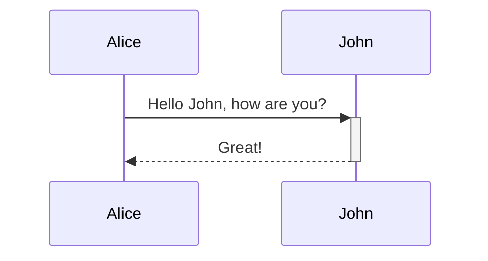
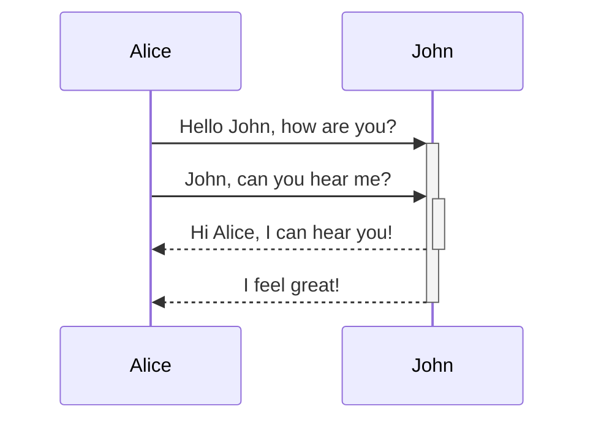
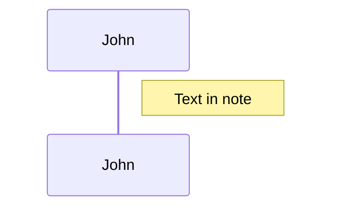
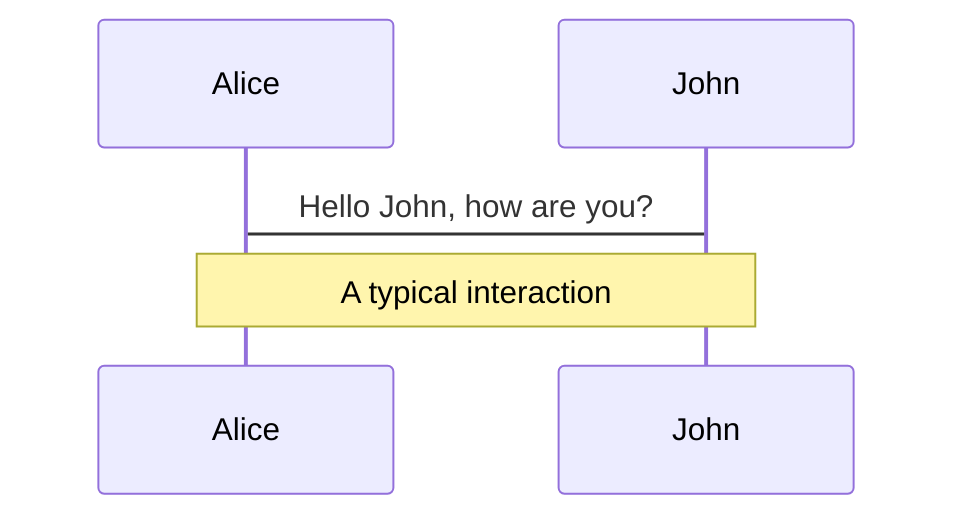
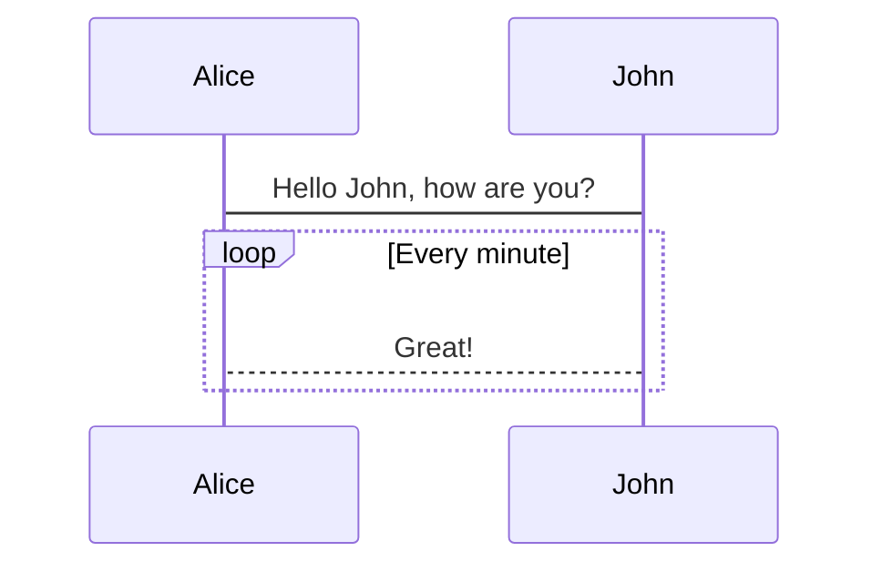
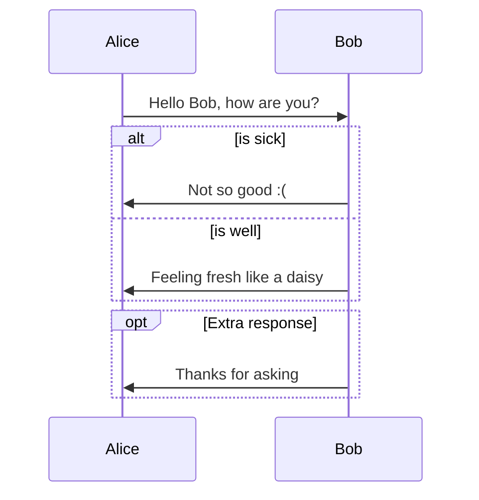

# 序列图

> 序列图是用来描述对象之间消息顺序的图（详细可以参见 [维基百科](https://en.wikipedia.org/wiki/Sequence_diagram) ）

Mermaid 可以用来生成序列图，下面是个完整的例子：



## 语法

### 参与者

参与者的定义可以和首个例子中隐式的声明定义，这样参与者或者执行者会在源代码定义中按照顺序渲染。

有时候想显示参与者为不同的顺序，而不是和上述例子中一样顺序输出。那么你可以如下显示声明参与者的顺序：



### 别名

每个执行者可以使用 id 然后带上对应的别名，方便记忆和整理。



## 信息

信息可以使用虚线以及实线来链接和标注，具体的语法参见：

```
[Actor][Arrow][Actor]:Message text
```

目前，有六个类型的箭头样式可以使用：

类型 | 描述
---  | ---
->   | 没有箭头实线
-->  | 没有箭头的虚线
->>  | 带箭头的实线
-->> | 带箭头的虚线
-x   | 带交叉箭头的实线（异步）
--x  | 带交叉箭头的虚线（异步）


## 激活

同时，支持描述是否激活（activate）制定的参与者。描述是否激活可以这样子定义：

> **Warning** 译者注：这里的表述可能会有些混淆，[根据 MSDN 的描述是「执行匹配项」](https://msdn.microsoft.com/zh-cn/library/dd409377.aspx)。



也可以使用 `+`/`-` 用于简化的描述，如下：



同个参与者可以堆叠「激活」，参见：




## 标注

序列图中支持标注定义，它基本的语法是 `Note [ right of | left of | over ] [Actor]: Text in note content` 。

类似以下的样子：



也可以同时在两个参与者同时显示标注，例如：




## 循环

同时也支持如何在图表中描述循环，它使用标注定义：

```
loop Loop text
... statements ...
end
```

参见下面的例子：



## 分支（Alt）

支持在图表中描述选择，它使用标注定义：

```
alt Describing text
... statements ...
else
... statements ...
end
```

或者描述以下是可选的（没有 else 语句）：

```
opt Describing text
... statements ...
end
```

下面是具体的例子：



## 样式化

序列图支持多种节点样式的自定义，下面是具体的样式类。

### 已经使用的样式类

样式类      | 描述
---          | ---
actor        | 序列图中执行者的边框样式
text.actor   | 序列图中执行者的文本样式
actor-line   | 执行者中的直线样式
messageLine0 | 实线信息线的样式
messageLine1 | 虚线信息线的样式
messageText  | 信息链接文案的样式
labelBox     | 循环框的样式
labelText    | 循环框的文本样式
loopText     | 循环框的内部文本样式
loopLine     | 定义循环框的行样式
note         | 标注框的样式
noteText     | 标注框的文本样式

### 样式例子

```css
body {
    background: white;
}

.actor {
    stroke: #CCCCFF;
    fill: #ECECFF;
}
text.actor {
    fill:black;
    stroke:none;
    font-family: Helvetica;
}

.actor-line {
    stroke:grey;
}

.messageLine0 {
    stroke-width:1.5;
    stroke-dasharray: "2 2";
    marker-end:"url(#arrowhead)";
    stroke:black;
}

.messageLine1 {
    stroke-width:1.5;
    stroke-dasharray: "2 2";
    stroke:black;
}

#arrowhead {
    fill:black;

}

.messageText {
    fill:black;
    stroke:none;
    font-family: 'trebuchet ms', verdana, arial;
    font-size:14px;
}

.labelBox {
    stroke: #CCCCFF;
    fill: #ECECFF;
}

.labelText {
    fill:black;
    stroke:none;
    font-family: 'trebuchet ms', verdana, arial;
}

.loopText {
    fill:black;
    stroke:none;
    font-family: 'trebuchet ms', verdana, arial;
}

.loopLine {
    stroke-width:2;
    stroke-dasharray: "2 2";
    marker-end:"url(#arrowhead)";
    stroke: #CCCCFF;
}

.note {
    stroke: #decc93;
    stroke: #CCCCFF;
    fill: #fff5ad;
}

.noteText {
    fill:black;
    stroke:none;
    font-family: 'trebuchet ms', verdana, arial;
    font-size:14px;
}
```


## 配置

我们可以调整序列图的间距等配置。使用 `mermaid.sequenceConfig`  或者在命令行下使用 json 格式文件进行配置。如何使用命令行下的配置可以参见 [mermaidCLI](zh-cn/mermaidCLI.html) 页面，`mermaid.sequenceConfig` 可以使用 JSON 字符串或者对应的对象。

```javascript
mermaid.sequenceConfig = {
    diagramMarginX:50,
    diagramMarginY:10,
    boxTextMargin:5,
    noteMargin:10,
    messageMargin:35,
    mirrorActors:true
};
```

### 可以使用的配置参数

参数 | 描述 | 默认值
--- | --- | ---
mirrorActor | 关闭或者打开参与者是否在覆盖在图中（不占用位置） | false
bottomMarginAdj | 调整图的下部边距，因为可能设置的样式边框过粗会超出边距，因此在实际情况中需要做适当的调整 | 1
